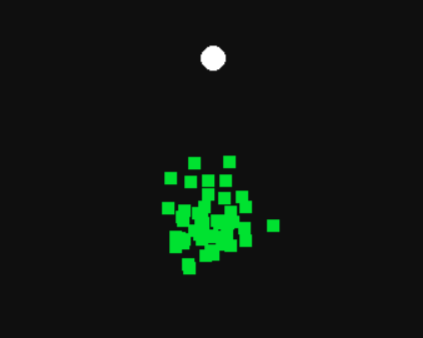

<p align="center">
  
</p>

# GeneticAlgorithm
An example of how a Genetic Algorithm works written in rust
## Build Instructions
Clone the Repo and then run:
```
cargo build
cargo run
```

## Genetic algorithm
- The algorithm works by creating objects with an array of random velocites to be added to the object's position for every frame.
- There is a set amount of frames per generation
  - also the length of the array.
- At the end of the generation
    - when we reach the last frame
- the closest object to a target's position has it's velocities duplicated and slightly 'mutated' to be used as the next generations velocities
